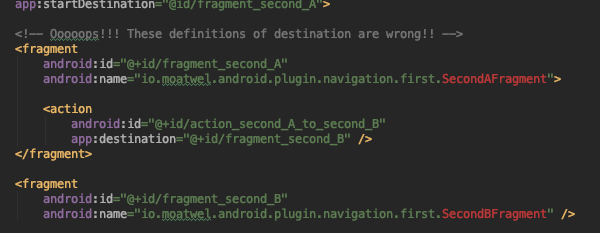

# NavGraphCheckerPlugin


## What's NavGraphCheckerPlugin?
NavGraphCheckerPlugin is a gradle plugin for checking navigation graph **at compile time**.

Even if there are some mistakes in navigation graph, now you can compile and build your project. Then you will notice the mistake only when you launch a screen which use the problematic navigation graph.




## How to use
```build.gradle
buildscript {
    repositories {
        maven {
            url "https://plugins.gradle.org/m2/"
        }
    }
    dependencies {
        classpath "gradle.plugin.io.moatwel.android.plugin:plugin:1.0.0-SNAPSHOT"
    }
}
```

```build.gradle
apply plugin: 'io.moatwel.android.plugin.navigation-tools'

android {
    ...
}
```

## At Compile Time
If there is some error in navigation graph, a below error has come.

```shell
Execution failed for task ':sample:checkNavGraph'.
> Error in NavGraph. [navigation_third_screen.xml, navigation_second_screen.xml]
```

in Android Studio, error shown like below.


## Sample
Clone this repo and check out the [sample](https://github.com/halu5071/NavGraphCheckerPlugin/tree/master/sample) module.

## How to build
1. Clone this repo.
2. Edit code
3. ./gradlew install

## Author
- Yasunori Horii
  - GitHub (https://github.com/halu5071)
  - Twitter (https://twitter.com/halu5071)

## License
```
Copyright 2020 Yasunori Horii.

Licensed under the Apache License, Version 2.0 (the "License");
you may not use this file except in compliance with the License.
You may obtain a copy of the License at

   http://www.apache.org/licenses/LICENSE-2.0

Unless required by applicable law or agreed to in writing, software
distributed under the License is distributed on an "AS IS" BASIS,
WITHOUT WARRANTIES OR CONDITIONS OF ANY KIND, either express or implied.
See the License for the specific language governing permissions and
limitations under the License.
```
